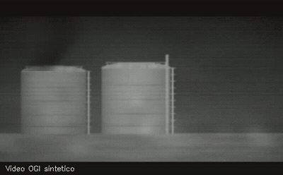
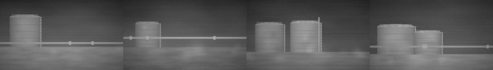
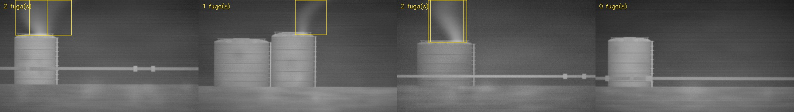

# Detector de fugas de gas en video OGI

Detección automática de penachos de metano en video de cámara termográfica
(Optical Gas Imaging), entrenado con datos sintéticos.



*Secuencia sintética: el video arranca sin marcas y a los dos segundos entra
la detección sobre los dos penachos.*

## El problema

La inspección de emisiones fugitivas con cámara OGI produce horas de video
donde la mayor parte del tiempo no pasa nada. Revisarlo fotograma a fotograma
para encontrar los momentos con fuga es lento y propenso a que algo se escape.

Entrenar un detector resolvería eso, pero choca con un obstáculo: hacen falta
miles de fotogramas etiquetados, y etiquetar penachos a mano —que no tienen
bordes definidos— es impreciso y costoso.

## El enfoque

En vez de etiquetar video real, **se generan los penachos**. Al construirlos
nosotros conocemos su posición exacta en cada fotograma, así que la etiqueta
sale gratis y es perfecta.

El penacho sintético reproduce lo que caracteriza al gas en OGI:

- **Turbulencia con ruido de Perlin fractal** — la nube se rompe en grumos
  que ascienden, en vez de ser una mancha lisa
- **Apertura en cono** — se ensancha con la altura
- **Serpenteo del eje** — no sube recto, oscila
- **Disipación progresiva** — se diluye al alejarse del punto de fuga
- **Doble polaridad** — el gas puede verse más oscuro o más claro que el
  fondo, según el modo de la cámara y la temperatura de la escena
- **Pérdida de nitidez** — el gas difumina lo que hay detrás

La escena tampoco es un fondo plano. Cada una varía en número y tamaño de
tanques, manchas térmicas sobre las superficies, tubería con bridas,
vegetación caliente al sol, viñeteado del lente, no uniformidad del sensor
y grano. Entre fotogramas se añade temblor de cámara con rotación y la
variación de contraste que introduce la ganancia automática.

La intensidad del penacho se parametriza para aproximar el caudal: una fuga
fuerte sube más rápido, llega más alto y se ve más densa.

### Escenas generadas



### Conjunto etiquetado automáticamente



Las cajas se calculan desde la máscara del penacho, no se dibujan a mano.
El cuarto ejemplo no tiene etiqueta: es una escena sin fuga, necesaria para
que el detector no confunda el temblor de cámara con gas.

## Estructura

| Archivo | Contenido |
|---|---|
| `penacho.py` | Ruido de Perlin fractal y modelo del penacho |
| `fondo.py` | Escenas sintéticas tipo OGI (tanques, tubería, vegetación, óptica) |
| `dataset.py` | Generación del conjunto etiquetado en formato YOLO |

## Uso

### Sin instalar nada

Abre `colab_ogi.ipynb` en Google Colab y ejecuta las celdas. Genera las
imágenes, el conjunto etiquetado y permite descargarlo, todo desde el
navegador.

[](https://colab.research.google.com/github/franyer98/ogi-leak-detector/blob/main/colab_ogi.ipynb)

### En local

```python
from dataset import construir
construir(n_secuencias=200, n_frames=12)
```

Genera `dataset/` con imágenes, etiquetas y `data.yaml`, listo para
entrenar un modelo de detección.

Los ejemplos negativos (secuencias sin fuga) son parte del conjunto: sin
ellos el detector tiende a marcar penachos donde solo hay temblor de cámara.

## Estado

- [x] Generador de penachos sintéticos
- [x] Escenas de fondo tipo OGI
- [x] Conjunto etiquetado automáticamente
- [ ] Entrenamiento del detector
- [ ] Validación contra video real
- [ ] Interfaz para procesar video completo

## Alcance

El sistema **detecta y localiza**; no cuantifica. El caudal en g/Hr sigue
saliendo de la cámara calibrada, como exige el procedimiento. El valor está
en reducir el tiempo de revisión del video, no en reemplazar la medición.
